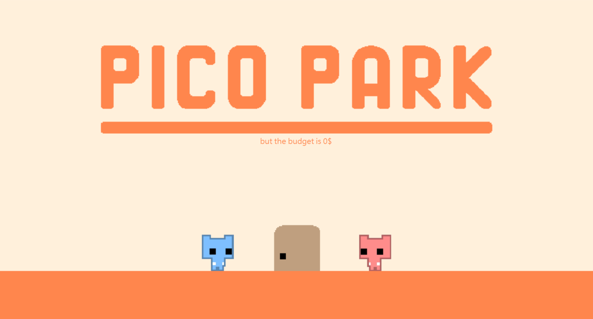
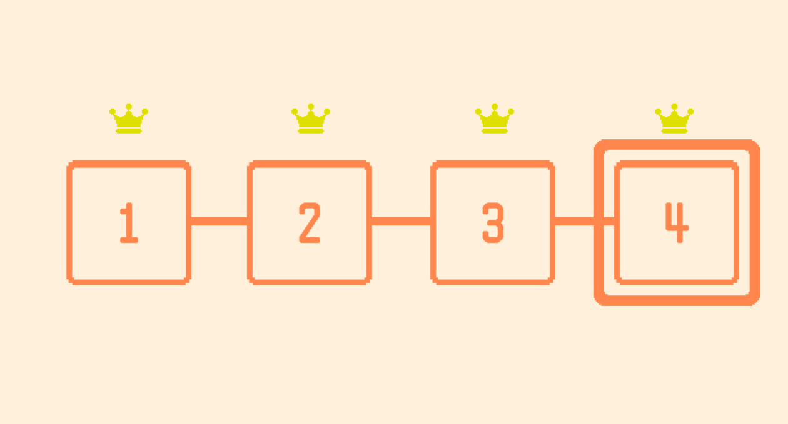
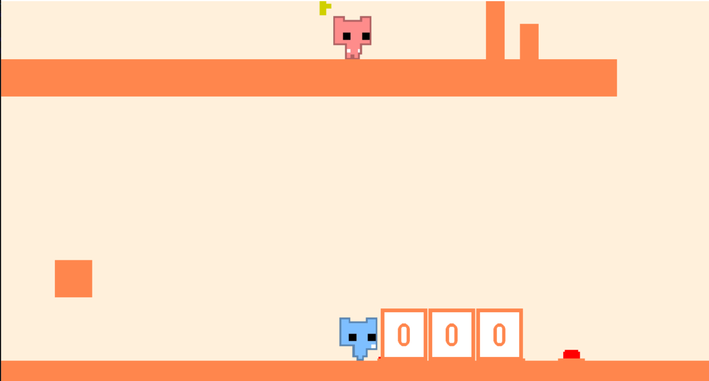
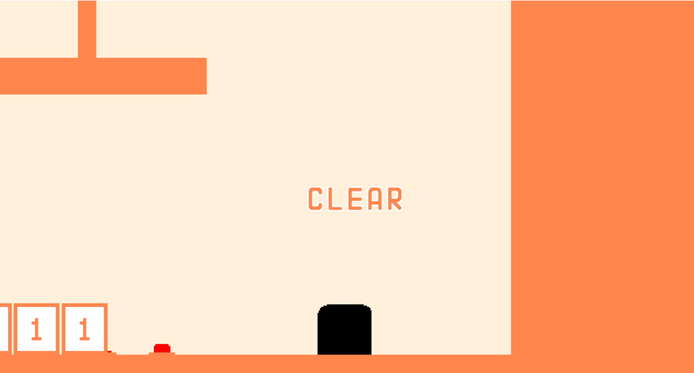

# Pico Park WinForms

A local two-player cooperative puzzle-platformer implemented in C# with Windows Forms, inspired by the first four levels of the original PICO PARK.

Two players share a keyboard and work together to overcome obstacles, collect a key, and reach the exit. Progress depends on cooperation: players can stand on each other, push boxes together, ride elevators, and activate switches to open a path forward. Both players must enter the exit to complete a level.

**This repository does not include game asset files and is intended for source code inspection only.** The original game's sprites, icons, sound effects, and background music are excluded, so this version cannot be built or run as-is. The screenshots below are provided only as visual previews.

## Features

- [x] Player movement and jumping
- [x] Gravity and collision detection
- [x] Player stacking
- [x] Cooperative box pushing
- [x] Player-count-based elevators
- [x] Key collection and following
- [x] Door unlocking and two-player level completion
- [x] Buttons and level-specific events
- [x] Respawn handling
- [x] Four levels and a lobby
- [x] Pause menu and level restart
- [x] Level selection
- [x] JSON progress saving and completion crowns
- [x] Shared horizontal camera
- [x] Character animation logic
- [x] Sound-effect and background-music playback logic

## System Support

- [x] Windows desktop (.NET 8 / Windows Forms)
- [x] Local two-player play on one computer
- [x] Shared-keyboard controls

## Controls

| Action | Player 1 | Player 2 |
| --- | --- | --- |
| Move left / right | A / D | J / L |
| Jump / enter or leave an open exit | W | I |
| Pause / resume | Esc | Esc |

## Implementation

- Built with **C#**, **.NET 8**, and **Windows Forms**.
- Uses custom `UserControl` objects, `PictureBox` sprites, and timers to manage gameplay.
- Separates game objects, scene loaders, and button events into dedicated classes, with shared state managed by `StateController`.
- Maps were planned visually in Unity, then translated into coordinates and dimensions for WinForms controls.

## Preview

### Title Screen

### Level Selection

### Cooperative Gameplay

### Level Complete

